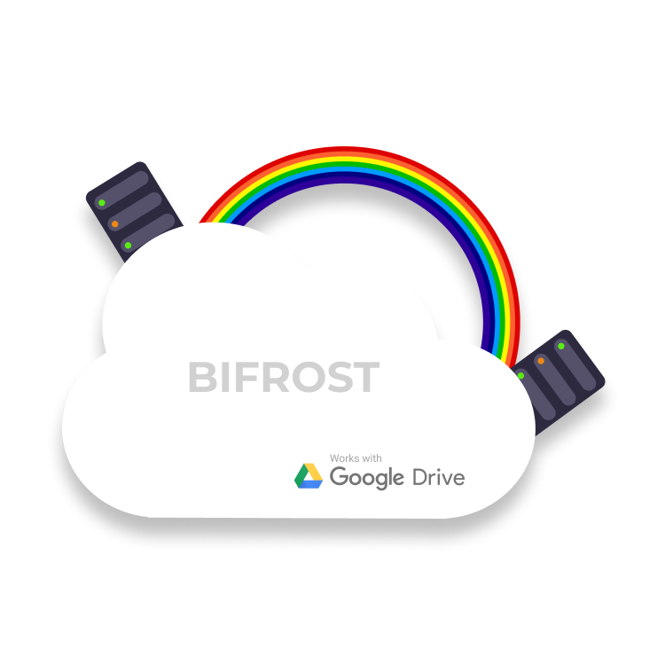

# google-drive-download

> Download files to google drive

  
This app uses [Google Drive APIs](https://developers.google.com/drive)
to upload files to authorized Google DriveTM.
What the app essentially does is stream the *file* through the hosted
server to the Google Driver server.
So the file gets to your Drive without using your network bandwidth.  
**But beware**, the hosting platform's bandwidth is used, which
may incur billings.

### Heroku
Heroku is kind of the best candidate in that case.
Heroku's [policy guidelines](https://www.heroku.com/policy/aup)
defines a limit on bandwidth which is more than any individual might need.
> Network Bandwidth: 2TB/month - Soft

Since no database or addons are required, this project can be hosted for free in [heroku](https://www.heroku.com/pricing).

### Google Cloud Platform

Since the app requires Google OAuth to work, it is obvious that
you require a [GCP](https://cloud.google.com/free) account.  
The GCP requirements for the project can be covered for free as
long as you stay inside the [limits](https://cloud.google.com/free)
that they have specified.

## Docs

 - [Prerequisites](./docs/prerequisites.md)
 - [Building the app](./docs/build.md)
