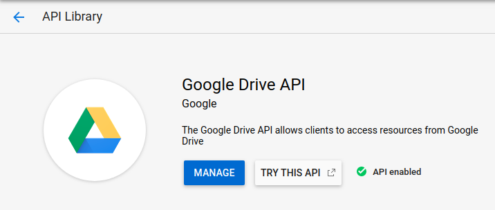
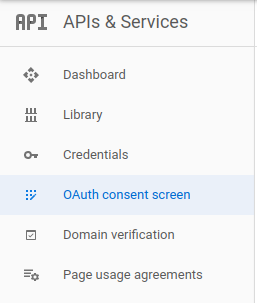
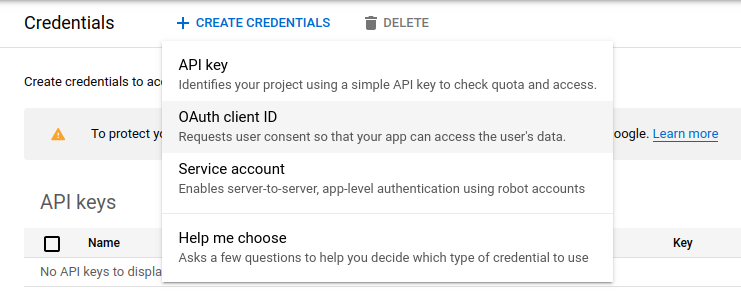
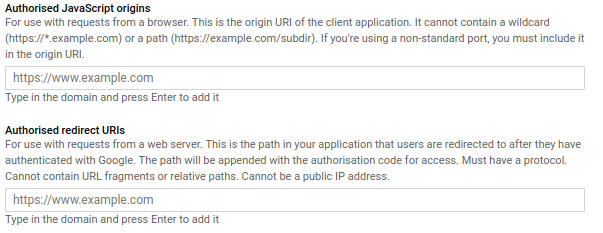

# Prerequisites

Before you start building or start playing with the server you
need to take care of a few things.

1. Head on to [Google Developer console](https://console.developers.google.com/apis/dashboard),
select an existing project or create a new project.
**Note:** *Creating a project in Developer Console creates a new GCP project.*

2. In the dashboard click on `Enable Apis and Services`.
Search for Google Drive API and enable this.  
**Note:** To do this you must complete *billing and verification* first.  

3. After its done create consent screen.  

4. Goto credentials in the dashboard and create new credentials,
select OAuth client ID. After that download the credentials as JSON.  
Or just copy `CLIENT_ID` and `CLIENT_SECRECT` and paste it in `.env` file  

## Authorized URIs
During creation of credentials & consent screen you might
come across something like below.  

**Authorized Javascript Origins** are in short the URL of the
website that is supposed to use OAuth.  
If you are hosting it in local machine this can be `http://localhost:3000`
or whatever port that you've configured in the `.env` file.  
Otherwise it can be `https://someapp.herokuapp.com` or something.

**Authorized redirect URIs** are the public available URLs that
Google redirects to after user login with required token.  
In our case the end point is `/auth/callback`.  
If you are hosting the app locally the host part could be
`http://lvh.me:3000`.So it will be `http://lvh.me:3000/auth/callback`.  
